## 2026 Q2 EVO Dependency Removal

Starting with the 2026 Q2 release, the AMS plugins were updated to operate without an NI legacy dependency called *EVO*.

## Impact for users

AMS Plugins developed by users with the *Battery Lab Software Plug-In Developer Toolkit 25Q4* or previous versions must be re-compiled to be loadable by 2026 Q2 release. Before compilation a couple of VIs must be modified as well. Please follow the steps below after installing the 2026 Q2 release if you require to update an existing plugin to be compatible with 2026 Q2 or later.

1. Open the LabVIEW project for your custom plugin while ignoring missing EVO dependencies. 
  - While the project loads, LabVIEW is expected to display dialogs searching for the following EVO dependencies (and potentially others). For each of these you can click *Cancel* and *Ignore Item*.
    - *GetCreateReason.vi*
    - *Handle.ctl*
    
  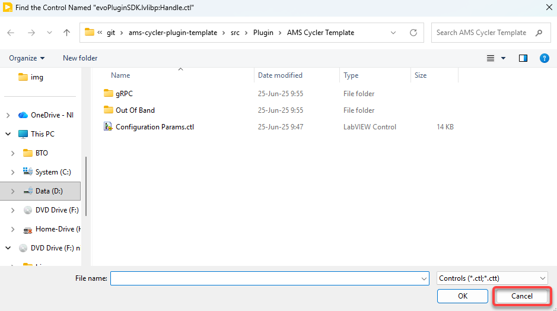
  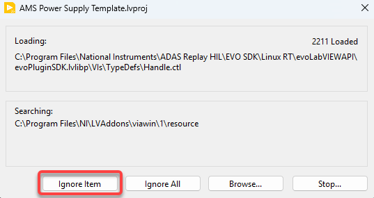

2. Update the *Refresh Configuration Parameters.vi*.

  - Navigate to your plugin library and class. Under the virtual folder *EVO (Don't Modify)* you should locate a VI called *Refresh Configuration Parameters.vi*.

  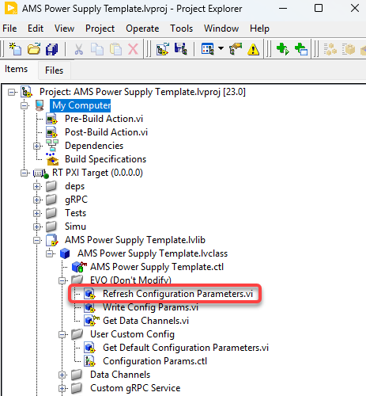

  - Rename this VI from *Refresh Configuration Parameters.vi* to *Init Configuration Parameters.vi*.

  - Update the front panel of *Init Configuration Parameters.vi* to look like the one on the image below.
    - Removed the elements `This`, `This out` and `In Initialize?`.
    - Added a new string control called `Node Config`. Pay attention to the location of this new control in the connector pane (this new control should be the second input on the left side of the connector pane).
  
  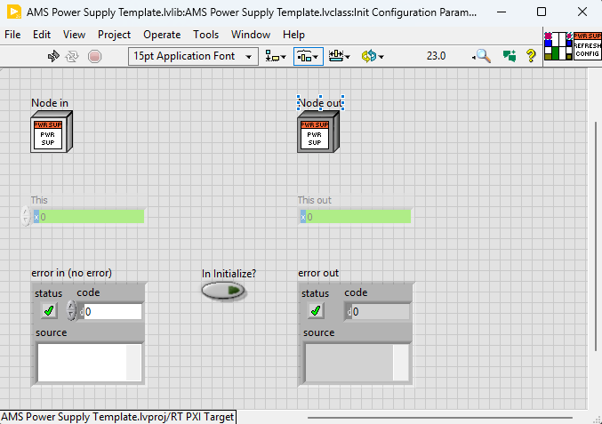
  
  - Update the block diagram of *Init Configuration Parameters.vi* as shown on the images below. The diagram is being simplified to only keep the portion of code within the red box.

    - Before the change:

    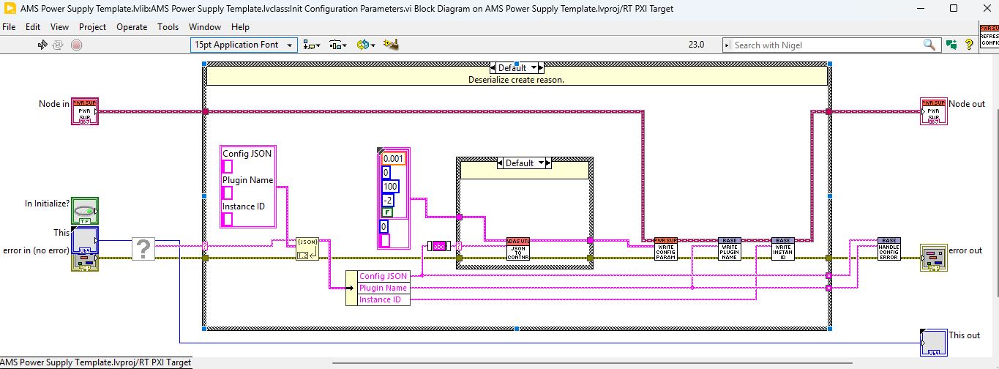

    - After the change:

    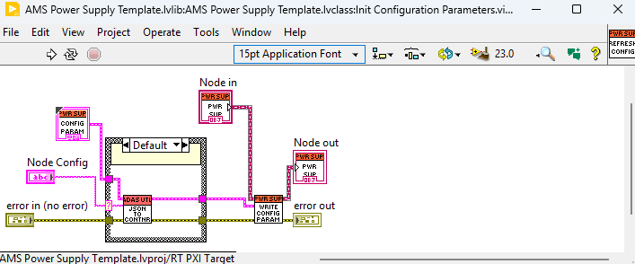

3. Update the plugin main test VI.
  - Locate and open the main test VI for your plugin under the *Tests* virtual folder.

  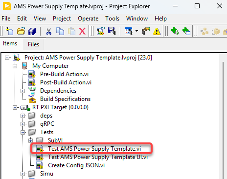

  - Update to remove all the inputs that are no longer required for the *Execute.vi* and *Finalize.vi*.

  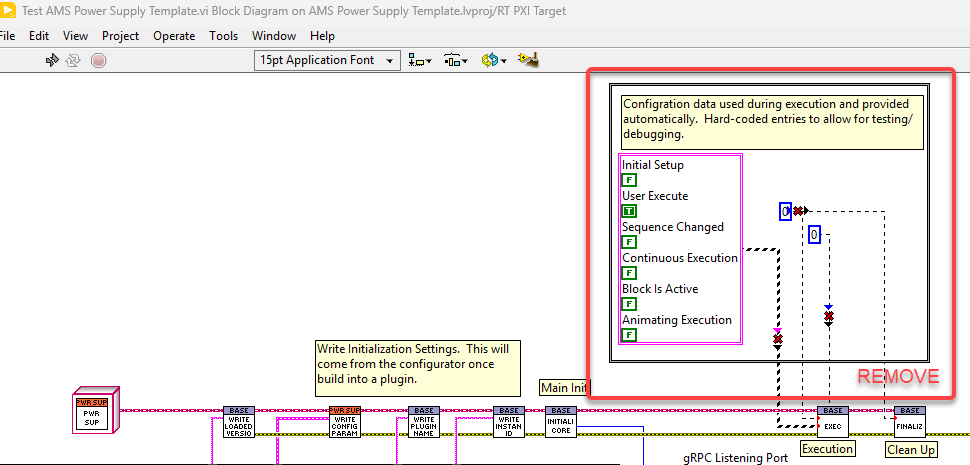

4. Update the Initialize VI.
  - Locate and open the *Initialize.vi* for your plugin and copy *Initialize Coordinator.vi*

  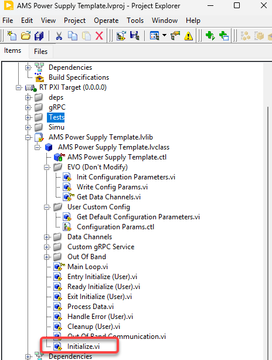
  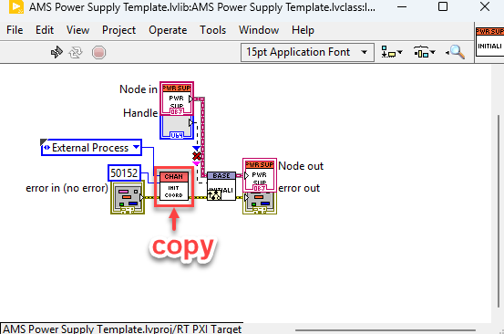

  - Close the vi, delete it, recreate it as overwrite VI and add *Initialize Coordinator.vi* again. Save it.

  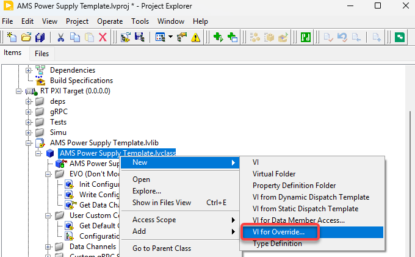
  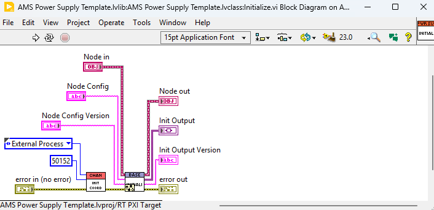

5. Increase the version of your plugin library (optionally, but recommended).
  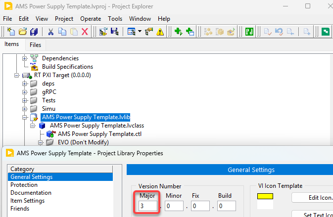

6. Save the project.

The updates should now be completed. Proceed with the build of your plugin. First build might throw an error, try a second time.
Once the new PPL is built you can attempt to load it with versions 2026 Q2 and later.