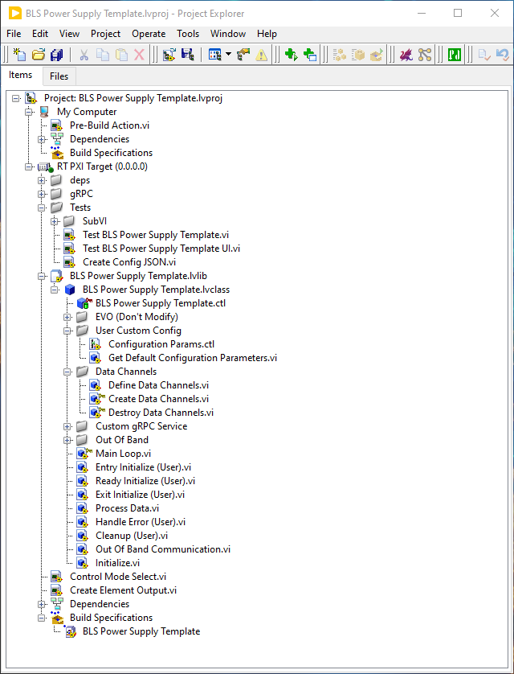

# Templates Overview
The BLS plugin templates are all based on the same project. They differ in using different capabilities.
A plugin will run on a PXI Target: The plugin can be loaded multiple times as different instances. When a plugin is loaded a json string is used to configure the plugin.

# Creating your own plugin

## Install requirements
1. Install PAtools (only needed if you will use the template with PAtools)
1. Install LabView
1. Install the ADAS Replay and HIL AD Development Suite for LabVIEW (if not installed together with PAtools).
1. Install JKI JSON, Structure Error Handler and JSONtext library from VI Package Manager.
1. Download and install the [ni-bls-capabilities package](ni-bls-capabilities_1.0.0.1_windows_x64.nipkg)

## Setup your project
Create a new LabView project by using a BLS plugin Template.
The installation of the package will also deliver the needed PAtools modules and example plugins. They are located under:
C:\Program Files\National Instruments\BLS plugin\PAtools

## Adapt the plugin to your needs
Since the structure is the same for each of the BLS templates, it is explained here using the Power Supply Template as an example:

The plugin will run under a PXI, therefore it is within a RT PXI Target.
In the folder "Tests", one can use the "Test BLS Power Supply.vi" and "Test BLS Power Supply Temlate UI.vi" in order to check if the plugin does run on the PXI target.
The "Create Config Json.vi" cannot be executed on the PXI target, therefore it has to be moved up to "My Computer" in order to execute it. It will create the json string needed to configure the plugin. Since it uses VIs from the class, it needs to be moved back in the Tests folder afterwards, otherwise LabView will give an error.
The main work is done in the "BLS Power Supply Template.lvclass". In principal you only need to adapt these files:

* "Configuration Params.ctl": Change, add or remove parameters you need in your configuration
* "BLS Power Supply Template.ctl": Add parameters, controls, etc. you need within your class in different VIs. Also here are the capabilities added. You can add further LLCs if needed. For your plugin you will probably use driver classes, you can also add them here.
* "Create Data Channels.vi": In this VI the channels are created which are needed to communicate to other systems, e.g. PAtools. If you added further LLCs you need to add the Initialize methods of them here. This VI is executed once by the plugin at start.
* "Exit Initialize (User).vi": Make calls to initialize your device and also fill the "Create Asset Json.vi" with correct inputs, by e.g. using driver calls to get the needed information. This VI is executed once by the plugin at start.
* "Cleanup (User).vi": Make calls to deinitialize your device correctly, e.g., turning it off.
* "Destroy Data Channels.vi": Add "Close" methods of the capabilities you added. This VI is executed once by the plugin at stop.
* "Process Data.vi": This VI is executed cyclic. Use the "Read" and "Write" methods of the capabilities to read or write data from or to the channels. The values provided by the "Read" methods should be used as inputs for the driver calls. Values gotten by a driver call can be written to the channels using the "Write" methods. (Remove the simulation between the "Read" and "Write" methods and also the "Reads" and "Writes" you do not need.)

## Testing without PAtools

### Within the Project
* Execute "Test BLS Power Supply.vi" and "Test BLS Power Supply Temlate UI.vi"

### With the AdasReplayHilApplication project
* Create the config json using the "Create Config Json.vi"
* Build the plugin and deploy it to the PXI
    - Build steps
        - Expand "RT PXI Target"
        - Expand "Build Specifications"
        - Right-click "BLS Power Supply Template" and select "Build"
* Make sure the plugin is on your PXI in the folder "/usr/lib/x86_64-linux-gnu/ni-evo-engine/plugins", otherwise copy the .lvlibp and give file permission
* Restart the PXI
* Open the "AdasReplayHilApplication.lvproj" (C:\Program Files\National Instruments\ADAS Replay HIL\App)
* Execute the "Example grpc CLient.vi"
* Type in the PXI ip in "Application grpc Server"
* Change to tab "Dynamic Workflow"
* Enter your Plugin Name, e.g. "BLS Power Supply Template", an Instance Name of your choice and copy the created config json string into "Node Confige in Json"
* Press "Load Node by Json"
* Switch main tab to "Node"
* Press "Refresh Node Status"
* Enter the Nide Instance Name you set and press "Start"
* Check if your plugin is working as expected

## Testing with PAtools
* Check the Template READMEs to create the PAtools driver
* Create a PAtools test with your created driver
* Execute the test and initialize the driver
* Test each function