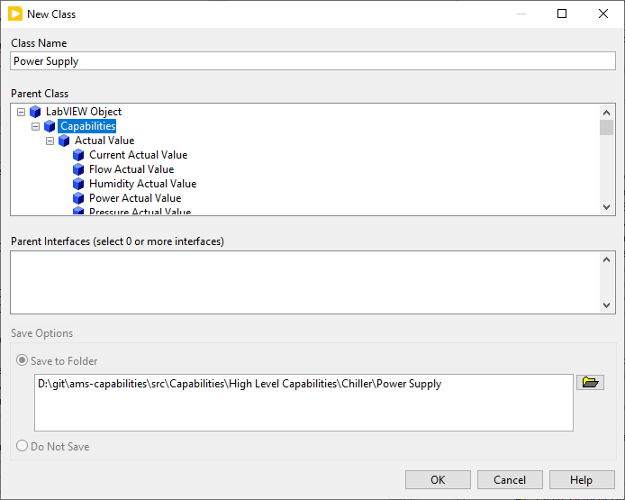

## Style Guide

These basic requirements should enforce meaningful consistency across capabilities without causing considerable developer pain.

1. All Block Diagrams should be arranged using `ctrl+u`
1. All Block Diagrams and Front Panels shall be sized using the built-in `ctrl+space` `ctrl+f` quick-drop formatter.
1. All Controls and Indicators on a block diagram shall be configured with "Show as Icon" `Unchecked`.
1. All Block Diagrams shall have Controls/Indicators formatted using the built-in `ctrl+space` `ctrl+t` quick-drop formatter.
1. All icons shall have a meaningful class name in the header.
1. All icons shall be formatted using the built-in `ctrl+space` `ctrl+k` quick-drop formatter (Use this after saving the VI).
1. All polymorphic accessors shall provide the Selector Name `Array` and `Single`, in that order.

# Capabilities

We categorize Capabilities in "Low Level Capabilities" (LLC) and "High Level Capabilities" (HLC). LLCs are intended to be used with any kind of device, not just a Power Supply (for example).
HLC are used to reflect device types, e.g. Cyclers, Climate Chambers, etc. They are either build up using LLCs or using Clusters to define a standard device which is compatible with e.g. PAtools.
LLCs might be derived using parent classes in order to reduce implementation work and increase maintainability.

# Cluster vs non Cluster
The Cluster implementation is more performant, depending on amount of channels used. Using multiple channels the Cluster variant is recommended, the "non Cluster" implementation is there for compatibility, since Cluster usage was added with 25Q4.

# Datatypes

Right now for the creation of channels only these datatypes are supported:
* INT8, INT16, INT32
* UINT8, UINT16, UINT32
* DOUBLE
* BOOLEAN

Note: UINT64, Timestamps and Single are not supported by PAtools

# Cluster Implementation
## Create new HLCs if not all channels are needed or there is a need to add further channels for your own usecase
If the HLC provides channels you do not need for your implementation or channels are missing, you can create a new class and use the Cluster.lvclass (or one of the other HLC classes) as a parent. And add/remove channels you need. (When creating/adapting VIs use the style guide above). ToDos:
1. Create a new class e.g. "Device Cluster.lvclass" in the RT PXI Target (If you created a new project from one of the templates ) or in My Computer (e.g. as part of the Capabilities project)
1. Select the parent class, which is one of the HLC Cluster classes (e.g. Power Supply Cluster.lvclass) or the Cluster class directly:

1. Open the "Device Cluster.lvclass" Class Properties and press "Edit Icon..." - adapt Line text 1 to e.g. "Device" and/or adapt the colours to your preference

1. Create a new Virtual Folder named "TypeDefs"
1. Create a typedef for each Cluster you want to use as a channel. The standard templates have:
* Consumer Control.ctl
* Consumer Ch.ctl
* Producer Control.ctl
* Producer Ch.ctl

1. Add the needed sub-channels you need by adding variables to each typedef. If you need similar once as the HLC provides, you can copy the Clusters from the HLC class and adapt them. (Note: Only copy the clusters and not the whole typedef, since this would lead to conflicts. )

1. Open the class ctl, e.g. Device Cluster.ctl
* Add a reference for each typedef you created. Change the references to array, which will be used as multiple channels

* Add a "Channels Amount" variable (U8 datatype recommended) if one of your clusters will be used as an array / multiple times the same channel content

* Add the type defs you created

* Convert the corresponding type defs to the array references to array and give them the name of the typedef. Adapt the default values to your needs

* Reorder controls in the cluster (if you use the standard layout) to
  * Consumer Control Ref
  * Consumer Control
  * Producer Control Ref
  * Producer Control
  * Channels Amount
  * Consumer Ch Ref
  * Consumer Ch
  * Producer Ch Ref
  * Producer Ch

1. Add Overwrite VIs "Build Channel Cluster Array.vi", "Close.vi", "Initialize.vi", "Read.vi", "Write.vi". Replace the parent VI with "sub vi content". If you have a different layout then the standard you might need to adapt these VIs further in order to have them functional. With the standard layout they do not need to be adapted further.

1. Add Getters and Setters VI. For the standard layout you will probably need "Get Consumer Values.vi", "Get Producer Values.vi", "Set Producer Values.vi". You can add additional Getters and Setters for specific values if needed. Note: use the type definitions for the in/outputs so in case you later add / remove / adapt variables the change is reflected automatically in the Getters and Setters as well. You can optionally add additional getters/setters for specific channels/variables.

1. In your plugin template you can now exchange your new "Device Cluster.lvclass" class with the used XY Cluster.lvclass (XY beeing PowerSupply, Cycler, etc.)

## Committing new HLCs
If you feel like your created HLC is something other users would benefit from you can add them to this project by creating a pull request. Describe what your added HLC is good for and why you think it is a reoccuring use case.

# Non Cluster Implementation
## Adding a new LLC
:cactus: When working with a team on Capabilities, be strategic when updating the AMS Capabilities project file because it will not be trivial to merge.

Once you know that you have a new generic capability LLC to implement, you're going to need to create a new folder and class, deriving from the Capability.lvclass or a parent class, e.g. Setpoint.lvclass or Actual Value.lvclass.

### Create the Class

1. Open the AMS Capabilities project.
1. Right-click the "Low Level Capabilities" folder or a matching subfolder (e.g. "Current").
1. Select New->Class.
1. Name your Capability.
1. Select the Capability class or a parent class as the Parent.

Your configuration should e.g. look like this if you are creating a "Resistance Actual Value" Capability using the Actual Value parent class:

### Edit Icon
After creating the class, edit the class Icon. This allows to later apply the same icon layout to all VIs inside the class:
1. Right-click the class -> Properties -> General Settings
1. Press Button "Edit Icon.."
1. Select register "Icon Text"
1. Enter in "Line 1 text" a fitting text which tells what class it is, e.g. "CURR AV"

### Add Data and Overrides

1. Open the class private data.
1. Right-click your class in the project.
1. Select New -> VI For Override.
1. Select Initialize and Close.
In these two overrides, instantiate and close the channels. Use other capabilities as a reference for how to handle multi-channel naming and how to format the channel names.

Depending on if you use the Capabilities.lvclass or an other parent class, you do the following:

#### Capabilities.lvclass
1. Copy/Paste an array of Channel and single references from another capability (if both are useful).
1. Rename the channel array / single.

#### Parent - e.g. Actual Value.lvclass
1. Also create Overrides for AV Write Array and AV Write Single
1. Open the Block Diagram of the Initialize.vi
1. Rename the ChannelName String to "not in use"
1. Disconnect it from the parent VI
1. Add a constant string to the ChannelName Input instead and configure the Name to be "ActualValue.ch%d.AV", where you replace the "ActualValue" with the Capabilitiy you are creating, e.g. Current, Voltage or Temperature

### Add VIs to palette
When you are done creating the VIs and applying the Style Guide, also create a new dir.mnu to add the VIs to the LabView palette. 
:cactus: Save everything and close/re-open LabVIEW for this. It's not the most stable tool.
Therefore do:
1. Tools > Advanced > Edit Palette Set.
1. Enter the Capabilities palette (if you do not have it, see chapter "Add Palette")
1. Right click -> Select "Insert Subpalette"
1. In the "Insert Palette" dialog, select "Create a new palette file" name it "dir" and save it in your created capability folder, e.g. "Temperature Actual Value".
1. Add the VIs to the newly created subpalette
  1. Right-click an empty slot in the new palette.
  1. Select "Insert" > "VI(s)..."
  1. Select all the VIs and select current folder to add all or repeat the last step to add them separately.
1. Save Changes

## Adding a new HLC

:cactus: When working with a team on Capabilities, be strategic when updating the AMS Capabilities project file because it will not be trivial to merge.

If you want to create a new High Level Capability, e.g. a "Power Supply", you're going to need to create a new folder and class, deriving from the Capability.lvclass.

### Create the Class

1. Open the AMS Capabilities project.
1. Right-click the "High Level Capabilities" folder.
1. Select New->Class.
1. Name your Capability.
1. Select the Capability class as the Parent.

Your configuration should e.g. look like this if you are creating a "Power Supply" HLC:

### Edit Icon
After creating the class, edit the class Icon. This allows to later apply the same icon layout to all VIs inside the class:
1. Right-click the class -> Properties -> General Settings
1. Press Button "Edit Icon.."
1. Select register "Icon Text"
1. Enter in "Line 1 text" a fitting text which tells what class it is, e.g. "POWER S"

### Add LLCs
Now add all LLCs which you want to use in your HLC and therefore making them a requirement. In order to do so:
1. Open the HLC class control VI, e.g. Power Supply.ctl
1. Drag and Drop all LLC lvclass Objects you want to use inside the "Cluster of class private data"

e.g. for a HLC called "Device", which uses the LLCs "Current Actual Value", "Current Setpoint", "Voltage Actual Value" and "Voltage Setpoint" it would look like that:

### Add Overrides

1. Open the class private data.
1. Right-click your class in the project.
1. Select New -> VI For Override.
1. Select Initialize and Close.
In these two overrides, instantiate and close the channels. Use the Initialize and Close VIs of the LLCs to do so by unbundling the HLC Object, e.g. for a HLC called "Device", which uses the LLCs "Current Actual Value", "Current Setpoint", "Voltage Actual Value" and "Voltage Setpoint" it would look like that:

### Add Data Accessors
For the capabilities you are using you need to create Data Accessors, depending on how your LLC looks like, you need to provide a Write or a Read VI. If you have Read/Writes for Single and Arrays, also provide polymorphic VIs. E.g. for the "Current Setpoint" LLC you need to create a "Current Read Array.vi", a "Current Read Single.vi" and the polymorphic "Current Read.vi" in your HLC.
The "Current Read Array.vi" would look like that:

### Add VIs to palette
When you are done creating all VIs and applying the Style Guide, also create a new dir.mnu to add the VIs to the LabView palette. 
:cactus: Save everything and close/re-open LabVIEW for this. It's not the most stable tool.
Therefore do:
1. Tools > Advanced > Edit Palette Set.
1. Enter the Capabilities palette (if you do not have it, see chapter "Add Palette")
1. Right click -> Select "Insert Subpalette"
1. In the "Insert Palette" dialog, select "Create a new palette file" name it "dir" and save it in your created capability folder, e.g. "Temperature Actual Value".
1. Add the VIs to the newly created subpalette
  1. Right-click an empty slot in the new palette.
  1. Select "Insert" > "VI(s)..."
  1. Select all the VIs and select current folder to add all or repeat the last step to add them separately.
1. Save Changes
Note: If you have polymorphic VIs only add the polymorphic VI to the palette and not the once it contains

## After adding a Capability
When you are done creating a capability, also add the description on the README.md in order to describe what the capability is good for and what it should do / be used for inside a driver

# Not yet in use
- AMS capabilities.dragon - Will provide dependencies for this project in the future
- lvaddoninfo.json - Will be used to create a package out of the project and versioning it
