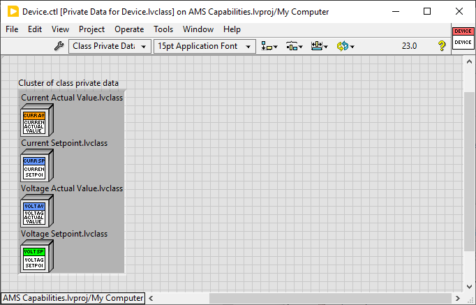
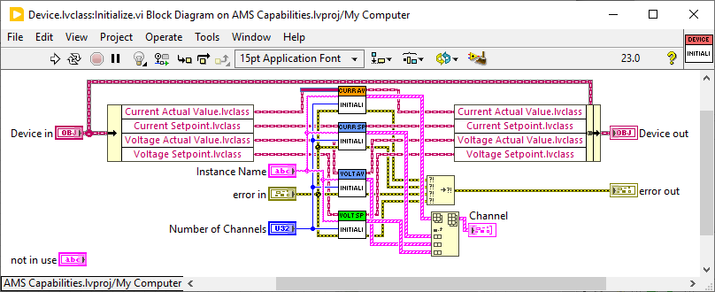
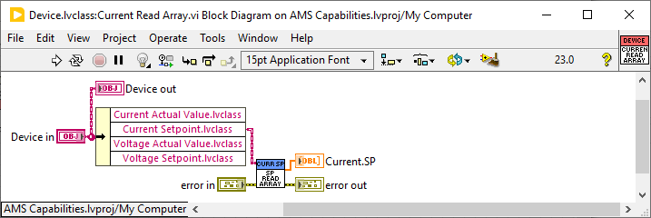

# Getting Started

Using Dragon, you can ensure you have the proper dependencies installed (Note not implemented yet!).
1. Install [JKI Dragon](https://dragon.vipm.io/)
1. Open the project with Dragon
  - This should automatically install dependencies and even LabVIEW if not installed.

A basic overview of the architecture can be found here:
https://nio365.sharepoint.com/:f:/s/EVValidationProgramTeam/Eurh0pxkQABJsnar0TopcSwB1FBsHLK8SbDPkYcjKlUcMA?e=YJwEnU
Note: The videos are not up to date

## Add Palette

To add the Capabilities to the palette do the following
1. Tools > Advanced > Edit Palette Set.
1. Right-click the block diagram palette.
1. Select "Insert Subpalette".
1. In the "Insert Palette" dialog, select "Link to an existing palette".
1. Select the root mnu at src/Capabilities/dir.mnu.

## Style Guide

These basic requirements should enforce meaningful consistency across capabilities without causing considerable developer pain.

1. All Block Diagrams should be arranged using `ctrl+u`
1. All Block Diagrams and Front Panels shall be sized using the built-in `ctrl+space` `ctrl+f` quick-drop formatter.
1. All Controls and Indicators on a block diagram shall be configured with "Show as Icon" `Unchecked`.
1. All Block Diagrams shall have Controls/Indicators formatted using the built-in `ctrl+space` `ctrl+t` quick-drop formatter.
1. All icons shall have a meaningful class name in the header.
1. All icons shall be formatted using the built-in `ctrl+space` `ctrl+k` quick-drop formatter. 
- Use this after saving the VI
1. All polymorphic accessors shall provide the Selector Name `Array` and `Single`, in that order.

# Capabilities

We categorize Capabilties in "Low Level Capabilties" (LLC) and "High Level Capabilities" (HLC). LLCs are intended to be used with any kind of device, not just a Cycler (for example).
HLC are used to reflect device types, e.g. Cyclers, Climate Chambers, etc. They are build up using LLCs to define a standard device which is compatible with e.g. PAtools.
LLCs might be derived using parent classes in order to reduce implementation work and increase maintainability.

# Datatypes

Right now for the creation of channels only these datatypes are supported:
* INT8, INT16, INT32, INT64
* UINT8, UINT16, UINT32
* DOUBLE
* BOOLEAN

Note: UINT64, Timestamps and Single are not supported by PAtools

# Adding a new LLC
:cactus: When working with a team on Capabilties, be strategic when updating the BLS Capabilities project file because it will not be trivial to merge.

Once you know that you have a new generic capability LLC to implement, you're going to need to create a new folder and class, deriving from the Capability.lvclass or a parent class, e.g. Setpoint.lvclass or Actual Value.lvclass.

## Create the Class

1. Open the BLS Capabilities project.
1. Right-click the "Low Level Capabilities" folder or a matching subfolder (e.g. "Current").
1. Select New->Class.
1. Name your Capability.
1. Select the Capability class or a parent class as the Parent.

Your configuration should e.g. look like this if you are creating a "Resistance Actual Value" Capability using the Actual Value parent class:

## Edit Icon
After creating the class, edit the class Icon. This allows to later apply the same icon layout to all VIs inside the class:
1. Right-click the class -> Properties -> General Settings
1. Press Button "Edit Icon.."
1. Select register "Icon Text"
1. Enter in "Line 1 text" a fitting text which tells what class it is, e.g. "CURR AV"

## Add Data and Overrides

1. Open the class private data.
1. Right-click your class in the project.
1. Select New -> VI For Override.
1. Select Initialize and Close.
In these two overrides, instantiate and close the channels. Use other capabilities as a reference for how to handle multi-channel naming and how to format the channel names.

Depending on if you use the Capabilities.lvclass or an other parent class, you do the following:

### Capabilities.lvclass
1. Copy/Paste an array of Channel and single references from another capability.
- :cactus: Channels are commonly arrays to natively support multi-output devices. If your channel is known to be only a single instance per-plugin, you can use an element instead of an array.
1. Rename the channel array / single.

### Parent - e.g. Actual Value.lvclass
1. Also create Overrides for AV Write Array and AV Write Single
1. Open the Block Diagram of the Initialize.vi
1. Rename the ChannelName String to "not in use"
1. Disconnect it from the parent VI
1. Add a constant string to the ChannelName Input instead and configure the Name to be "ActualValue.ch%d.AV", where you replace the "ActualValue" with the Capabilitiy you are creating, e.g. Current, Voltage or Temperature

## Add VIs to palette
When you are done creating the VIs and applying the Style Guide, also create a new dir.mnu to add the VIs to the LabView palette. 
:cactus: Save everything and close/re-open LabVIEW for this. It's not the most stable tool.
Therefore do:
1. Tools > Advanced > Edit Palette Set.
1. Enter the Capabilities palette (if you do not have it, see chapter "Add Palette")
1. Right click -> Select "Insert Subpalette"
1. In the "Insert Palette" dialog, select "Create a new palette file" name it "dir" and save it in your created capability folder, e.g. "Temperature Actual Value".
1. Add the VIs to the newly created subpalette
1. Save Changes

# Adding a new HLC

:cactus: When working with a team on Capabilties, be strategic when updating the BLS Capabilities project file because it will not be trivial to merge.

If you want to create a new High Level Capability, e.g. a "Power Supply", you're going to need to create a new folder and class, deriving from the Capability.lvclass.

## Create the Class

1. Open the BLS Capabilities project.
1. Right-click the "High Level Capabilities" folder.
1. Select New->Class.
1. Name your Capability.
1. Select the Capability class as the Parent.

Your configuration should e.g. look like this if you are creating a "Power Supply" HLC:

## Edit Icon
After creating the class, edit the class Icon. This allows to later apply the same icon layout to all VIs inside the class:
1. Right-click the class -> Properties -> General Settings
1. Press Button "Edit Icon.."
1. Select register "Icon Text"
1. Enter in "Line 1 text" a fitting text which tells what class it is, e.g. "POWER S"

## Add LLCs
Now add all LLCs which you want to use in your HLC and therefore making them a requirement. In order to do so:
1. Open the HLC class control VI, e.g. Power Supply.ctl
1. Drag and Drop all LLC lvclass Objects you want to use inside the "Cluster of class private data"

e.g. for a HLC called "Device", which uses the LLCs "Current Actual Value", "Current Setpoint", "Voltage Actual Value" and "Voltage Setpoint" it would look like that:

## Add Overrides

1. Open the class private data.
1. Right-click your class in the project.
1. Select New -> VI For Override.
1. Select Initialize and Close.
In these two overrides, instantiate and close the channels. Use the Initialize and Close VIs of the LLCs to do so by unbundling the HLC Object, e.g. for a HLC called "Device", which uses the LLCs "Current Actual Value", "Current Setpoint", "Voltage Actual Value" and "Voltage Setpoint" it would look like that:

## Add Data Accessors
For the capabilities you are using you need to create Data Accessors, depending on how your LLC looks like, you need to provide a Write or a Read VI. If you have Read/Writes for Single and Arrays, also provide polymorphic VIs. E.g. for the "Current Setpoint" LLC you need to create a "Current Read Array.vi", a "Current Read Single.vi" and the polymorphic "Current Read.vi" in your HLC.
The "Current Read Array.vi" would look like that:

## Add VIs to palette
When you are done creating all VIs and applying the Style Guide, also create a new dir.mnu to add the VIs to the LabView palette. 
:cactus: Save everything and close/re-open LabVIEW for this. It's not the most stable tool.
Therefore do:
1. Tools > Advanced > Edit Palette Set.
1. Enter the Capabilities palette (if you do not have it, see chapter "Add Palette")
1. Right click -> Select "Insert Subpalette"
1. In the "Insert Palette" dialog, select "Create a new palette file" name it "dir" and save it in your created capability folder, e.g. "Temperature Actual Value".
1. Add the VIs to the newly created subpalette
1. Save Changes
Note: If you have polymorphic VIs only add the polymorphy VI to the palette and not the once it contains

# After adding a Capability
When you are done creating a capability, also add the description on the README.md in order to describe what the capability is good for and what it should do / be used for inside a driver

# Not yet in use
- BLS capabilities.dragon - Will provide dependencies for this project in the future
- lvaddoninfo.json - Will be used to create a package out of the project and versioning it
