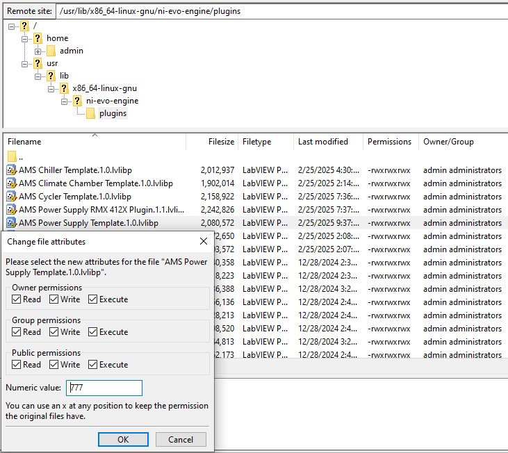

# PAtools Integration

This document describes the process of integrating a new AMS plugin/Driver in PAtools using the Template_AMS_PowerSupply module as an example. Other Templates are quite similar. If there are any additional steps, they will be described in the PAtools Integration README of the specific template.
This document assumes you have the LabView side of the AMS plugin ready using [capabilities](https://github.com/ni/ams-capabilities) and the PXI target has the PAtools runtime installed. 

# Create PAtools driver using Template

1. If you do not already have the Template_PowerSupply_AMS module in your database, import it:

    

    

2. Right-click on the module and select "Duplicate Module...".

    

3. The window for duplicating the module opens:

    

    * Target Path: Adapt as you like
    * Find*: enter "Template_PowerSupply_AMS"
    * Replace*: enter your device name / a module name, e.g. "NI_RMX412X"
    
    Press "Duplicate". When finished, the module "NI_RMX412X_(Module_NI_RMX412X)" appears in the path you selected

    Note: In the following, the used Normnames/Variables/Group names will all start with "NI_RMX412x". For you, they will start with what ever you entered in the Replace* field.

4. Import the generated Json Configuration for PAtools to AMS group

    4.1 Open the AMS Plugin Control group "NI_RMX412x"
    4.2 Go to the overview by clicking on "NI_RMX412x" and import the Json Configuration using the Instance name "NI_RMX412x_InstanceName"
        
    4.3 Adapt the Operation Group if needed, e.g. from 100Hz to 1Hz/10Hz/1000Hz
    4.4 Go back to the instance by clicking on "NI_RMX412x_InstanceName"
    4.5 Check if all channels have a fitting variable, if not adapt them to your needs. You can also deactivate channels you do not want to use (e.g. if you imported a Json with 32 channels, but later on just want to use 16).
        It is advised to use the same operation group for all entries. Boolean, INT8, UINT8, INT16, UINT16 and INT32 on LabView side are Integers on PAtools side. UINT32 and DOUBLES on LabView side are Floats on PAtools side.
    4.6 Switch from "Channels" to "Settings"
         
    4.7 Check the Default Parameters and adapt them to your need. If you create variables for them make sure to add them to the initialization of variables group "NI_RMX412x_Config" in the module config folder and also in the "NI_RMX412x" variables group in the module system folder.
    4.8 Make sure that under "Default Parameters - Common"  for "Iteration Interval (s)" the variable "NI_RMX412x_Plugin_Execution_Interval.SP" is used
    4.9 Remove not anymore used config variables in the initialization of variables group "NI_RMX412x_Config" and in the "NI_RMX412x" variables group
    4.10 Adapt the values in "NI_RMX412x_Config" to your needs, make sure you use a unique "AMS Plugin Instance Name"

5. General Adaptions

    5.1 In the "NI_RMX412X_UB" Variables group (NI_RMX412X_system/userbox)
        * NI_RMX412x_Main.UB.Header: Enter a name you want to display in the Userbox, e.g. "NI_RMX412X"

    5.2 In the "NI_RMX412X_MULTIL.TAB" table (NI_RMX412X_system/userbox)
        * NI_RMX412x_UB_ModuleDescription.CA.TXT: For each language, enter a name you want to display at the bottom of the Userbox, e.g. "NI_RMX412X"

    5.3 In the "NI_RMX412X_Version" Variables group (NI_RMX412X_system/version)
        * NI_RMX412x_Version: 1.0.0 (enter a version you would like to start with, 1.0.0 is an example here)

    5.4 In the PAbasic "NI_RMX412X_Version" adapt the content so you give the following information: when you created that module, who created it (in the example it is "BTO"), and which template version you used, e.g. like that:

    

    Note: When you adapt the module later, you can increase the version and add also information here.  

    5.5 In the Initialization of Variables group "NI_RMX412X_Config":

    * AMS Plugin Address: Enter the address of the device, could be an IP address
    * AMS Instance Name: Give an unique Instance Name under which the plugin should be loaded
    * AMS Plugin Execution Frequency: Select the Frequency with which you want to execute the plugin in Hz
    * AMS Plugin Name: Name of the plugin, e.g. "AMS Power Supply Template" 
    * AMS Plugin Version: Enter the plugin version, e.g. "1.0"
    * Timeout for initializing: Give a value (in seconds) for how long to wait until a timeout is triggered

    Note: The name of the lvlibp is e.g. "AMS Power Supply Template.1.0.lvlibp". So the front part is the plugin name, followed by the version. Only enter the name without the version and ending to the AMS Plugin Name and also just write the version on the AMS Plugin Version.

    5.6 In the Initialization of Variables group "NI_RMX412X.ch01" (NI_RMX412X_config/NI_RMX412x.ch01) adapt the initialization values to that of your device

    Note: When you make changes to ch01, also do that for ch02, alternatively delete the NI_RMX412X.ch02 folder and duplicate the NI_RMX412X.ch01 folder again

6. Adapt Userbox

    You can adapt the Userbox tabs:

    * "NI_RMX412X.ch01.TAB" (NI_RMX412X_config/NI_RMX412X.ch01) for things belonging to each channel
    * "NI_RMX412X_Main.UB.TAB" (NI_RMX412X_system/userbox) for things belonging to the whole plugin
    * "NI_RMX412X_Configuration.UB.TAB" (NI_RMX412X_system/userbox) for the plugin configuration

7. Check Monitorings

    Check the existing monitorings/alarms and add them if you miss something.

    * "NI_RMX412X.ch01.MON" (NI_RMX412X_config/NI_RMX412X.ch01): For channel monitoring
    * "NI_RMX412X_MON" (NI_RMX412X_system/monitoring): For overall monitoring

8. Adaptions if you have a different amount of channels compared to the template
    
    If you have fewer channels just remove the excess folders in the NI_RMX412X_config, if you have more just duplicate them.

9. Adapt Mappings

    If you need mappings from or to a different module, you can add them to mapping tables in the NI_RMX412X_config.

10. STMC 

    If you want to use STMC make sure that:
    * You use an unique STMC ID
    * You adapted the NI_RMX412X_STMC.TAB, NI_RMX412X_STMC.PS and NI_RMX412X.ch01.Init.PS as you need

11. Optionally you can add additional functionality in the driver, e.g. calculations

# Using an AMS Control group without a whole module template

For simple plugins it might be that you do not need a device template, but just an AMS Control group
1. Create an AMS Control group
2. Import the Json configuration and create a new InstanceName
3. Create integer variables for Control, Status and Channel Status (also add them to a variable group)
4. Add channel variables
5. Adapt the Settings, if you create variables for that, add them to an initialization of variables group and a variable group
6. With the Control variable you can set the plugin from the "pause" state to running state, by changing the value to "1". You can set it back to a "pause" state by changing it back to "0". With "2" you can force a reload of the plugin.
    With the Status variable you can check the state of the plugin: < 0: error, 0: unloaded, 1: loading, 2: Loaded/Paused, 3: Running
    With the Channel Status variable you can check the combined channel state: <0:error, 1:ok
7. Create monitorings, calculations, etc. you need

# Using an AMS Client group
The AMS client group is only reading or writing values to a plugin channel, it can not control the plugin. So if you have a test controlling a plugin you can have an other test or component using the AMS Client group.
To configure it you need to do the same steps as for the control group, besides having no "settings" part, since that is determined by the Control group. Use the exact same instance name and make sure that you imported the same Json config as you used for the Control group.
The the Control variable can only be set to "0" (not reading/writing) and "1" (read/write). The status are identical.
Important: While every Client/Control can read values, only one is allowed to write on a channel. Therefore deactivate the channels you do not need. Also make sure that only in one group a specific output channel is active.

# Test PAtools driver

1. Make sure the plugin was deployed to the PXI:
    * it should be in /usr/lib/x86_64-linux-gnu/ni-evo-engine/plugins
    * permission of the file ".lvlib" should be so every user is allowed to read, write and execute the file:

        

    * restart the system

2. Add the driver to a test and deploy the test

3. Load the test

4. Add the userbox "NI_RMX412_Main.UB.TAB"

5. Initialize the driver

6. Test each functionality, including error scenarios

    
